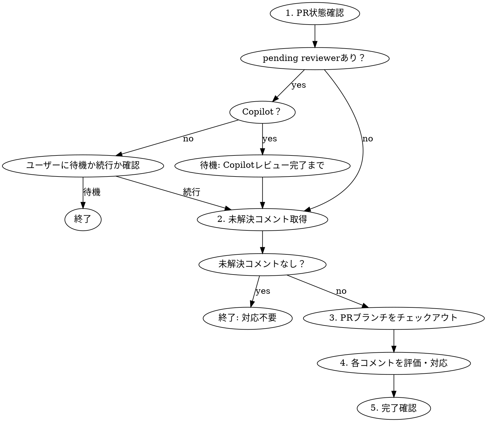

# PR Review Comment 対応

PRのレビューコメントに体系的に対応する。PR番号は `$ARGUMENTS` で与えられる。与えられなければカレントブランチのPRを対象とする。

## ワークフロー



### 1. PR状態確認

```bash
gh pr view <NUMBER> --json reviewRequests,reviews,reviewDecision,state,headRefName
```

- `reviewRequests`: 未提出のレビュアー一覧
- `reviewDecision`: `APPROVED` / `CHANGES_REQUESTED` / `REVIEW_REQUIRED`
- `state`: `OPEN` / `CLOSED` / `MERGED`

未提出レビュアーの扱い:
- **Copilot**: 常に待機する。Copilotのレビューが届くまで次のステップに進まない。
- **それ以外**: ユーザーに **待機するか続行するか** 確認する。勝手に判断しない。

### 2. 未解決コメント取得

`gh pr view --json` には `reviewThreads` フィールドがない。**GraphQL API必須。**

同梱スクリプトを使用:

```bash
~/.claude/skills/address-pr-review/fetch-unresolved-threads.sh <NUMBER>
```

出力: 未解決スレッド(`isResolved == false`)のみのJSON配列。各要素は `threadId`, `outdated`, `path`, `line`, `firstComment`, `replies` を含む。`outdated: true` のスレッドも含まれるが、コード変更済みのため対応不要の可能性が高い。内容は確認すること。

### 3. PRブランチをチェックアウト

```bash
gh pr checkout <NUMBER>
```

### 4. 各コメントを評価・対応

未解決スレッドごとに以下を実行:

1. **該当コードを読む**: `path` と `line` から対象ファイル・行を確認
2. **指摘を評価**: 以下の基準で判断

**修正する:**
- バグ・ロジックエラー
- セキュリティリスク
- プロジェクト規約・スタイル違反
- テスト不足
- パフォーマンス問題

**問題なしと主張する:**
- PRスコープ外の指摘
- 意図的な設計判断（根拠を示す）
- レビュアーの誤読（該当コードを引用して説明）

3. **対応を実行**:
   - 修正する場合: コードを修正し、コミット
   - 問題なしの場合: 理由を明確にまとめる

4. **評価結果をユーザーに提示**: 各コメントについて「修正する / 問題なしと主張する」の判断と理由をユーザーに示し、**承認を得てから** 返信する

5. **スレッドに返信し、resolve する**:

```bash
# スレッドの最初のコメントの databaseId を使用
gh api repos/{owner}/{repo}/pulls/<NUMBER>/comments \
  -f body="<返信内容>" \
  -F in_reply_to=<COMMENT_DATABASE_ID>

# 返信後、スレッドを resolve する（threadId は fetch-unresolved-threads.sh の出力から取得）
gh api graphql -f query='mutation { resolveReviewThread(input: {threadId: "<THREAD_ID>"}) { thread { isResolved } } }'
```

### 5. 完了確認

```bash
# 修正をpush
git push

# CIステータス確認
gh pr checks <NUMBER>
```

修正完了後、レビュアーに再レビューを依頼する場合:

```bash
gh api repos/{owner}/{repo}/pulls/<NUMBER>/requested_reviewers \
  -f 'reviewers[]=<REVIEWER_LOGIN>'
```

## 注意事項

- `gh api` の `{owner}` と `{repo}` はカレントリポジトリから自動補完される
- outdatedスレッドも内容は確認する。コードが変わっても指摘自体が有効な場合がある
- 返信完了後、スレッドを resolve する。返信と resolve はセットで行う
- 返信はスレッド内に行う。PRトップレベルのコメントではない
- 全対応完了後にまとめてpushする。コメントごとにpushしない
